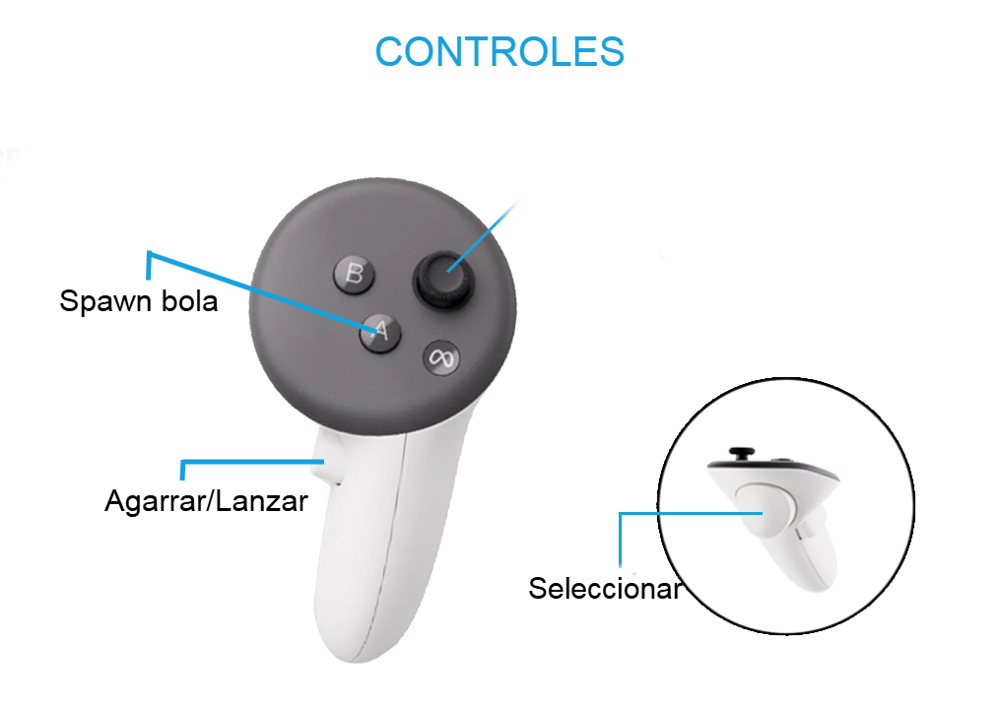

# 📄 AIM GOOD RV

## 📌 Descripción de la Experiencia

Se trata de una experiencia en la que el jugador deberá afinar su punteria para lanzar unas bolas a diferentes dianas y asi conseguir la máxima puntuación. El jugador aparecerá en un menu desde donde prodra elegir si empezar la partida o salir, al empezar la partida apareceran unas dianas encima delante suya junto a un temporizador y un contador de puntos. A su lado dispondra de varias pelotas que podra lanzar a las dianas para sumar puntos. Al acabar el tiempo un menu le permitirá volver a jugar o salir.

## 📌 Cómo Jugar / Controles

- Interacturar con las opciones del menú:
  - Apuntar con el control derecho/izquierdo y apretar el gatillo correspondiente cuando se apunte a la opcion deseada.
- Spawnear Bola
  - Pulsado la A del controlador derecho spawnera una bola en la mesa de la derecha.
- Coger pelota
   - Acercar la mano derecha hacia una pelota y mantener pulsado el boton de agarre. Al mover la mano la pelota se movera con ella.
- Lanzar bola
  - Apuntar hacia la diana y soltar el boton de agarre del mando. 

### 📷 Controles

## 📌 Licencias

- Plugin OpenXR: Licencia Unreal Engine Marketplace
- Plugin OpenXRHandTracking:  Licencia Unreal Engine Marketplace

Para los modelos y texturas se han empleado los que ya vienen por defecto en Unreal Engine.

---

## 📌 Descripción del Proceso de Creación

He comenzado creado el level menu, partiendo de la plantilla vacia. He creado un BluePrint widget que contenia el canvas con los dos botones y he conectado los botones a sus respectivas acciones. Luego he creado un BP Actor para poder instancias el widget anteriormente creado y poder arrastarlo a la escena. 
Luego creé un BP PawnVR al que agregué una camara, dos MotionControler (left & right) a los que agregue como hijos un Widget Interaction Component para poder interactuar con el menú. Además marque la opcion de debug para poder ver el raycast de las manos.
Mas adelante creé el gamemodebasic y puse por defecto el pawvr que acaba de crear.

Mas tarde creé el level GameMap, añadí un temporizador con un render 3d que con un loop me permitia mostar una variable local timer y decrementarla cada segundo. Luego cree una diana, que no es mas que un cilindro rotado con fisicas y colisiones. Añadi bp para que al colisionar con las bolas sumase puntos al jugador. Para eso cree como para el timer un render 3d al que puse los puntos del jugador para poder mostarlos en tiempo real. Tambien tuve que crear el BP_Ball, una esfera con fisicas y colision. Ahora para que el pawn pudiera coger las bolas le agregue un sphere colision a su mano derecha, que me permitia detectar colisiones con las pelotas. Cuando se mantenia el boton de agarre se anula las fisicas de la pelota y se la ancla a la mano. Al soltar se desancla, se devuelve las fisicas y se lanza. Por ultimo añadi la lógica del final del juego, cuando el temporizador llega a 0 se muestra un canvaslayer con los puntos que conseguiste y la opción de volver a jugar o de salir.

## 📌 Dificultades Encontradas y Cómo las He Resuelto

Numerosas han sido las dificultades.
  - Falta total de información: hasta para la cosa mas básica como crear un PawnVR existen muy poca información puesto que es algo que la plantilla de VR de unreal ya trae. Lo cual es normal por que nadie se pondria a hacer de 0 algo que ya está. Solución: Buscarme la vida donde sea, cualquier video, post en internet o articulo con un minimo de información.
  - Imposibilidad de debuggear como es debido: Al no contar con ningun dispositivo de RV me ha sido imposible comprobar como a mi me gustaria el correcto funcionamiento del juego. Desarrollando practicamente a ciegas. Solucion: Ninguna, bindear el juego para que tambien funcione con los controles de pc es cuanto menos una odisea y no merece la pena perder el tiempo ahí. 
  - Limitación de hardware: Mi equipo no es ni mucho menos potente lo que me ha provocado retrasos sobretodo a la hora de empaquetar el pryecta ya que ha llegado a tardar 3 horas initerrumpidas el finalizar el empaquetado. Solución: ninguna.
---

## 📌 Siguientes Pasos

Si tuviera unas gafas y un ordenador decente podria debugear todo bien y pulir las fisicas y la mecanica principañ. Luego podria añadir modelos y tecturas personalizadas para crear un mejor ambiente además de música y efectos sonoros que mejorarian notablemente la experiencia de usuario.

